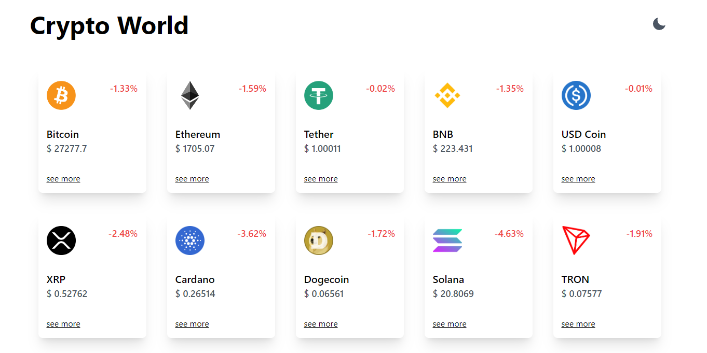

# Crypto World

Crypto World is a website that displays real-time information about the prices of the most popular cryptocurrencies. The project was developed using React, TypeScript, and Tailwind CSS.

## Features

- Real-time price visualization of the most popular cryptocurrencies.
- Responsive interface with adaptable layout for different devices.
- Use of smooth animations for a pleasant user experience.
- Integration with an API to fetch updated cryptocurrency data.
- Intuitive and easy-to-navigate user interface.

## Technologies Used

- **React**: JavaScript library for building user interfaces.
- **TypeScript**: JavaScript superset that adds static typing.
- **Tailwind CSS**: Utility-first CSS framework for quick and consistent styling.
- **Cryptocurrency API**: Integration with an API to fetch price data.

## How to Access the Site

You can access the Crypto World website by following this link: [Crypto World](https://crypto-world-phi.vercel.app/). The website provides real-time cryptocurrency price information and more.
